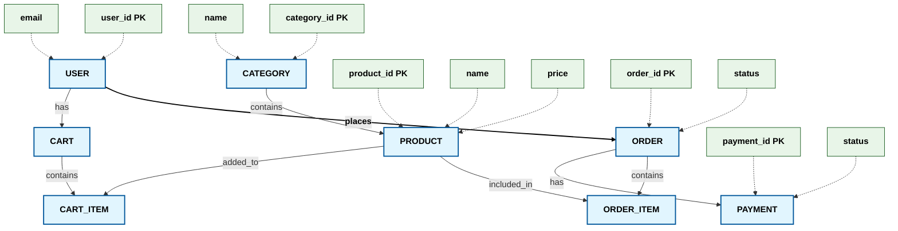

# Электронный магазин - ER-диаграмма (Питер Чен)

```mermaid
flowchart TD
    %% Сущности
    USER[USER]
    CATEGORY[CATEGORY]
    PRODUCT[PRODUCT]
    CART[CART]
    ORDER[ORDER]
    PAYMENT[PAYMENT]
    CART_ITEM[CART_ITEM]
    ORDER_ITEM[ORDER_ITEM]
    
    %% Связи
    USER -->|places| ORDER
    USER -->|has| CART
    CATEGORY -->|contains| PRODUCT
    CART -->|contains| CART_ITEM
    ORDER -->|contains| ORDER_ITEM
    PRODUCT -->|included_in| ORDER_ITEM
    ORDER -->|has| PAYMENT
    PRODUCT -->|added_to| CART_ITEM
    
    %% Основные атрибуты
    USER_ID[user_id PK] -.-> USER
    USER_EMAIL[email] -.-> USER
    
    CATEGORY_ID[category_id PK] -.-> CATEGORY
    CATEGORY_NAME[name] -.-> CATEGORY
    
    PRODUCT_ID[product_id PK] -.-> PRODUCT
    PRODUCT_NAME[name] -.-> PRODUCT
    PRODUCT_PRICE[price] -.-> PRODUCT
    
    ORDER_ID[order_id PK] -.-> ORDER
    ORDER_STATUS[status] -.-> ORDER
    
    PAYMENT_ID[payment_id PK] -.-> PAYMENT
    PAYMENT_STATUS[status] -.-> PAYMENT
    
    %% Стили
    classDef allBlack color:#000000,font-weight:bold,stroke:#000000
    class USER,CATEGORY,PRODUCT,CART,ORDER,PAYMENT,CART_ITEM,ORDER_ITEM,USER_ID,USER_EMAIL,CATEGORY_ID,CATEGORY_NAME,PRODUCT_ID,PRODUCT_NAME,PRODUCT_PRICE,ORDER_ID,ORDER_STATUS,PAYMENT_ID,PAYMENT_STATUS allBlack
    classDef blackText fill:#e1f5fe,stroke:#01579b,color:#000000,font-weight:bold
    classDef blackArrow color:#000000,font-weight:bold
    class USER,CATEGORY,PRODUCT,ORDER blackText
    linkStyle 0 stroke:#000000,stroke-width:2px,color:#000000,font-weight:bold
    classDef entity fill:#e1f5fe,stroke:#01579b,stroke-width:2px
    classDef relationship fill:#f3e5f5,stroke:#4a148c,stroke-width:1px
    classDef attribute fill:#e8f5e8,stroke:#1b5e20,stroke-width:1px
    
    class USER,CATEGORY,PRODUCT,CART,ORDER,PAYMENT,CART_ITEM,ORDER_ITEM entity
    class USER_ID,USER_EMAIL,CATEGORY_ID,CATEGORY_NAME,PRODUCT_ID,PRODUCT_NAME,PRODUCT_PRICE,ORDER_ID,ORDER_STATUS,PAYMENT_ID,PAYMENT_STATUS attribute
```
