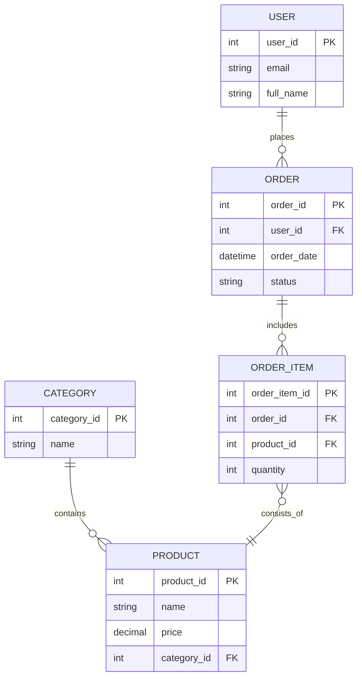

# ER-диаграмма электронного магазина

## Описание бизнес-процессов
- Регистрация пользователей
- Каталогизация товаров  
- Оформление заказов
- Оплата и доставка

## ER-модель

```mermaid
erDiagram
    USER {
        int user_id PK
        string email
        string full_name
    }

    PRODUCT {
        int product_id PK
        string name
        decimal price
        int category_id FK
    }

    CATEGORY {
        int category_id PK
        string name
    }

    ORDER {
        int order_id PK
        int user_id FK
        datetime order_date
        string status
    }

    ORDER_ITEM {
        int order_item_id PK
        int order_id FK
        int product_id FK
        int quantity
    }

    USER ||--o{ ORDER : places
    CATEGORY ||--o{ PRODUCT : contains
    ORDER ||--o{ ORDER_ITEM : includes
    ORDER_ITEM }o--|| PRODUCT : consists_of
```
