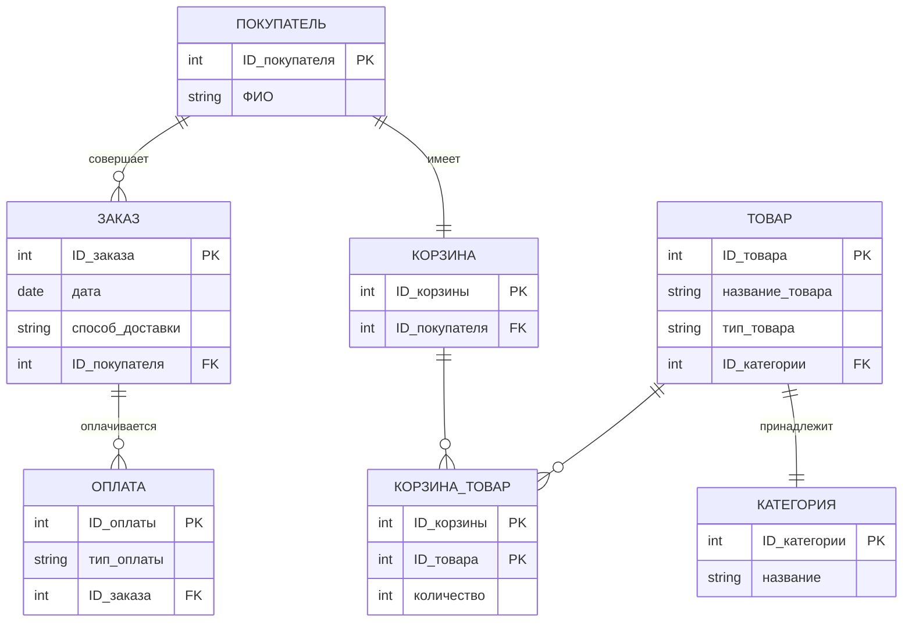

```mermaid
erDiagram
    ПОКУПАТЕЛЬ {
        int ID_покупателя PK
        string ФИО
    }
    
    КОРЗИНА {
        int ID_корзины PK
        int ID_покупателя FK
    }
    
    ЗАКАЗ {
        int ID_заказа PK
        date дата
        string способ_доставки
        int ID_покупателя FK
    }
    
    ОПЛАТА {
        int ID_оплаты PK
        string тип_оплаты
        int ID_заказа FK
    }
    
    ТОВАР {
        int ID_товара PK
        string название_товара
        string тип_товара
        int ID_категории FK
    }
    
    КАТЕГОРИЯ {
        int ID_категории PK
        string название
    }
    
    КОРЗИНА_ТОВАР {
        int ID_корзины PK
        int ID_товара PK
        int количество
    }
    
    ПОКУПАТЕЛЬ ||--|| КОРЗИНА : "имеет"
    ПОКУПАТЕЛЬ ||--o{ ЗАКАЗ : "совершает"
    ЗАКАЗ ||--o{ ОПЛАТА : "оплачивается"
    ТОВАР ||--|| КАТЕГОРИЯ : "принадлежит"
    КОРЗИНА ||--o{ КОРЗИНА_ТОВАР : ""
    ТОВАР ||--o{ КОРЗИНА_ТОВАР : ""
```
