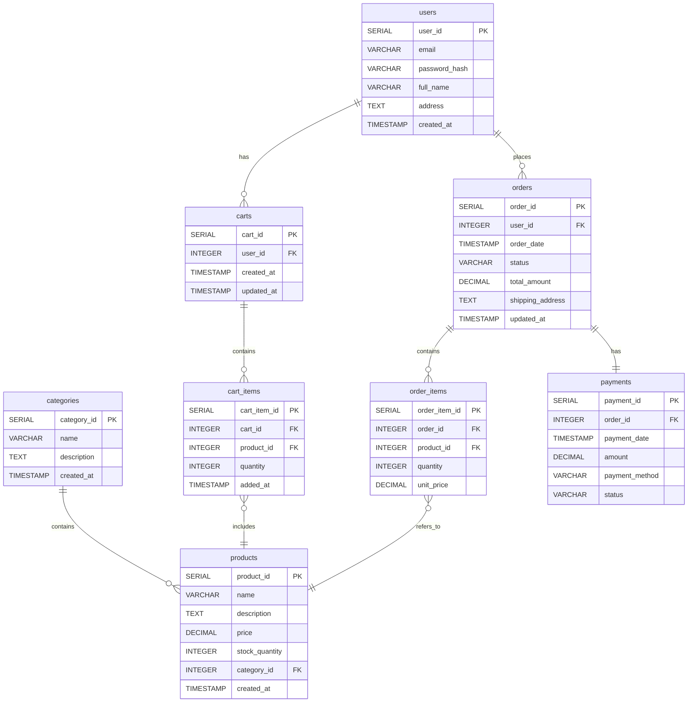

```mermaid
erDiagram
    users {
        SERIAL user_id PK
        VARCHAR email
        VARCHAR password_hash
        VARCHAR full_name
        TEXT address
        TIMESTAMP created_at
    }
    
    categories {
        SERIAL category_id PK
        VARCHAR name
        TEXT description
        TIMESTAMP created_at
    }
    
    products {
        SERIAL product_id PK
        VARCHAR name
        TEXT description
        DECIMAL price
        INTEGER stock_quantity
        INTEGER category_id FK
        TIMESTAMP created_at
    }
    
    carts {
        SERIAL cart_id PK
        INTEGER user_id FK
        TIMESTAMP created_at
        TIMESTAMP updated_at
    }
    
    cart_items {
        SERIAL cart_item_id PK
        INTEGER cart_id FK
        INTEGER product_id FK
        INTEGER quantity
        TIMESTAMP added_at
    }
    
    orders {
        SERIAL order_id PK
        INTEGER user_id FK
        TIMESTAMP order_date
        VARCHAR status
        DECIMAL total_amount
        TEXT shipping_address
        TIMESTAMP updated_at
    }
    
    order_items {
        SERIAL order_item_id PK
        INTEGER order_id FK
        INTEGER product_id FK
        INTEGER quantity
        DECIMAL unit_price
    }
    
    payments {
        SERIAL payment_id PK
        INTEGER order_id FK
        TIMESTAMP payment_date
        DECIMAL amount
        VARCHAR payment_method
        VARCHAR status
    }

    users ||--o{ carts : "has"
    users ||--o{ orders : "places"
    categories ||--o{ products : "contains"
    carts ||--o{ cart_items : "contains"
    cart_items }o--|| products : "includes"
    orders ||--o{ order_items : "contains"
    order_items }o--|| products : "refers_to"
    orders ||--|| payments : "has"
```
