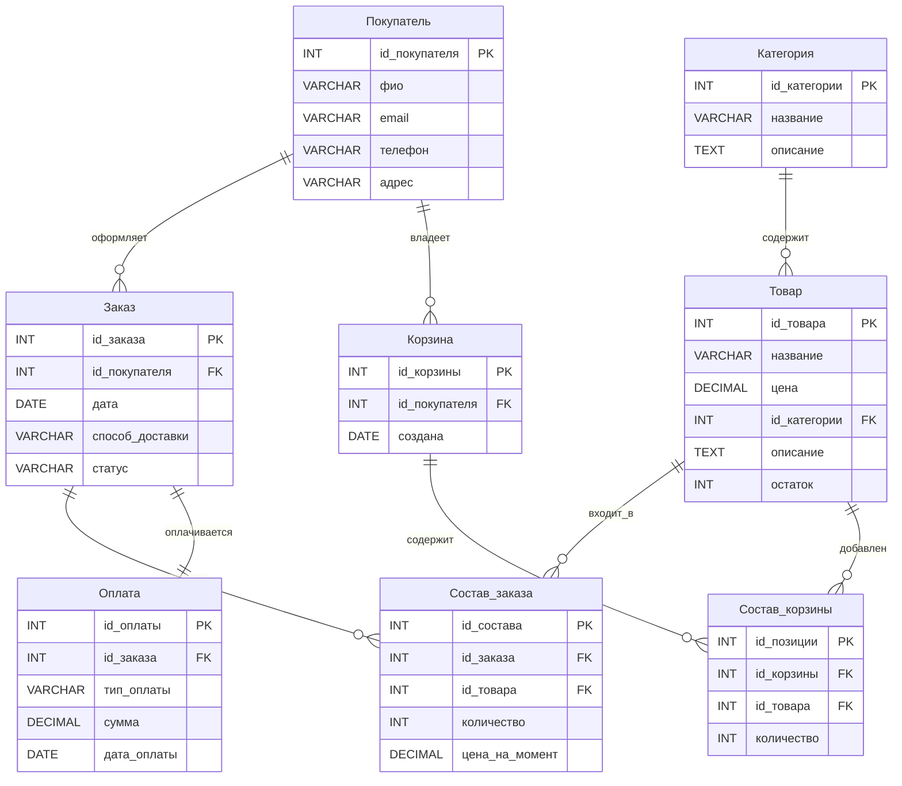

```mermaid
erDiagram
    Покупатель {
        INT id_покупателя PK
        VARCHAR фио
        VARCHAR email
        VARCHAR телефон
        VARCHAR адрес
    }

    Категория {
        INT id_категории PK
        VARCHAR название
        TEXT описание
    }

    Товар {
        INT id_товара PK
        VARCHAR название
        DECIMAL цена
        INT id_категории FK
        TEXT описание
        INT остаток
    }

    Заказ {
        INT id_заказа PK
        INT id_покупателя FK
        DATE дата
        VARCHAR способ_доставки
        VARCHAR статус
    }

    Оплата {
        INT id_оплаты PK
        INT id_заказа FK
        VARCHAR тип_оплаты
        DECIMAL сумма
        DATE дата_оплаты
    }

    Корзина {
        INT id_корзины PK
        INT id_покупателя FK
        DATE создана
    }

    Состав_заказа {
        INT id_состава PK
        INT id_заказа FK
        INT id_товара FK
        INT количество
        DECIMAL цена_на_момент
    }

    Состав_корзины {
        INT id_позиции PK
        INT id_корзины FK
        INT id_товара FK
        INT количество
    }

    %% Связи между таблицами
    Покупатель ||--o{ Заказ : оформляет
    Покупатель ||--o{ Корзина : владеет
    Категория ||--o{ Товар : содержит
    Заказ ||--o{ Состав_заказа : включает
    Товар ||--o{ Состав_заказа : входит_в
    Корзина ||--o{ Состав_корзины : содержит
    Товар ||--o{ Состав_корзины : добавлен
    Заказ ||--|| Оплата : оплачивается

```
