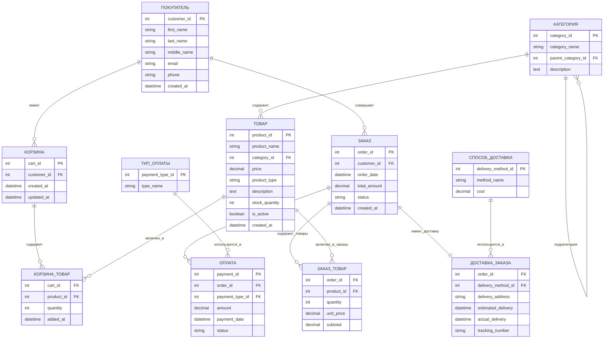

```mermaid
erDiagram
    ПОКУПАТЕЛЬ {
        int customer_id PK
        string first_name
        string last_name
        string middle_name
        string email
        string phone
        datetime created_at
    }
    
    КОРЗИНА {
        int cart_id PK
        int customer_id FK
        datetime created_at
        datetime updated_at
    }
    
    ЗАКАЗ {
        int order_id PK
        int customer_id FK
        datetime order_date
        decimal total_amount
        string status
        datetime created_at
    }
    
    СПОСОБ_ДОСТАВКИ {
        int delivery_method_id PK
        string method_name
        decimal cost
    }
    
    ТИП_ОПЛАТЫ {
        int payment_type_id PK
        string type_name
    }
    
    ОПЛАТА {
        int payment_id PK
        int order_id FK
        int payment_type_id FK
        decimal amount
        datetime payment_date
        string status
    }
    
    КАТЕГОРИЯ {
        int category_id PK
        string category_name
        int parent_category_id FK
        text description
    }
    
    ТОВАР {
        int product_id PK
        string product_name
        int category_id FK
        decimal price
        string product_type
        text description
        int stock_quantity
        boolean is_active
        datetime created_at
    }
    
    КОРЗИНА_ТОВАР {
        int cart_id FK
        int product_id FK
        int quantity
        datetime added_at
    }
    
    ЗАКАЗ_ТОВАР {
        int order_id FK
        int product_id FK
        int quantity
        decimal unit_price
        decimal subtotal
    }
    
    ДОСТАВКА_ЗАКАЗА {
        int order_id FK
        int delivery_method_id FK
        string delivery_address
        datetime estimated_delivery
        datetime actual_delivery
        string tracking_number
    }

    ПОКУПАТЕЛЬ ||--o{ КОРЗИНА : "имеет"
    ПОКУПАТЕЛЬ ||--o{ ЗАКАЗ : "совершает"
    КОРЗИНА ||--o{ КОРЗИНА_ТОВАР : "содержит"
    ТОВАР ||--o{ КОРЗИНА_ТОВАР : "включен_в"
    ЗАКАЗ ||--o{ ОПЛАТА : "имеет_платежи"
    ЗАКАЗ ||--o{ ЗАКАЗ_ТОВАР : "содержит_товары"
    ТОВАР ||--o{ ЗАКАЗ_ТОВАР : "включен_в_заказы"
    ЗАКАЗ ||--|| ДОСТАВКА_ЗАКАЗА : "имеет_доставку"
    СПОСОБ_ДОСТАВКИ ||--o{ ДОСТАВКА_ЗАКАЗА : "используется_в"
    ТИП_ОПЛАТЫ ||--o{ ОПЛАТА : "используется_в"
    КАТЕГОРИЯ ||--o{ ТОВАР : "содержит"
    КАТЕГОРИЯ ||--o{ КАТЕГОРИЯ : "подкатегория"
```
